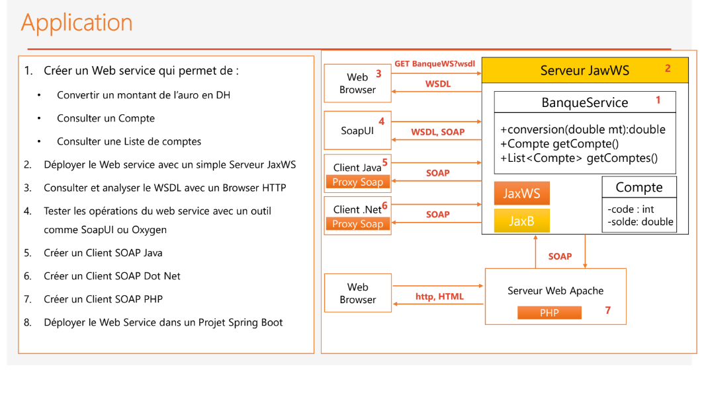
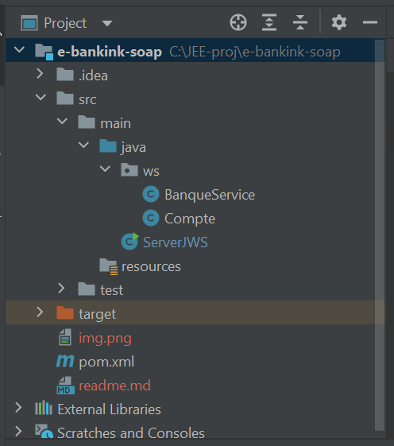
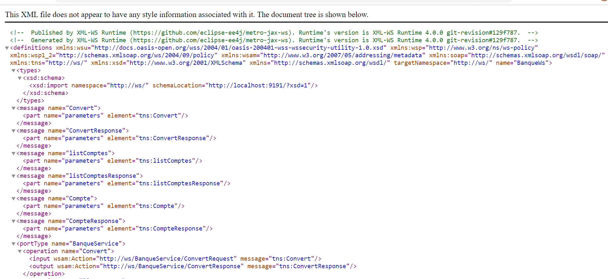

# Ebanking-SOAP-App

> ## 1- architecture  du projet :

> ## 2- Créer l'entité Compte :
    public class Compte {
    private int code;
    private double solde;
    private Date dateCreation;

    public Compte(int code, double solde, Date dateCreation) {
        this.code = code;
        this.solde = solde;
        this.dateCreation = dateCreation;
    }
    public Compte() {

    }

    public int getCode() {
        return code;
    }

    public void setCode(int code) {
        this.code = code;
    }

    public double getSolde() {
        return solde;
    }

    public void setSolde(double solde) {
        this.solde = solde;
    }

    public Date getDateCreation() {
        return dateCreation;
    }

    public void setDateCreation(Date dateCreation) {
        this.dateCreation = dateCreation;
    }
}

> ## 3- Créer l'entité Banque Service :
    @WebService(serviceName = "BanqueWs")
    public class BanqueService {
    @WebMethod(operationName = "Convert")
    public double conversion(@WebParam(name = "montant") double mt){
    return mt*10.54;
    }
    @WebMethod(operationName = "Compte")
    public Compte getCompte(@WebParam(name = "code")int code){
    return new Compte(code,Math.random()*9888,new Date());
    }
    public List<Compte> listComptes(){
    return List.of(
    new Compte(1,Math.random()*9888,new Date()),
    new Compte(2,Math.random()*9888,new Date()),
    new Compte(3,Math.random()*9888,new Date())
    );
    }
    }
> ## 4- ajouter la dependance jaxws :
    <dependencies>
        <dependency>
            <groupId>com.sun.xml.ws</groupId>
            <artifactId>jaxws-ri</artifactId>
            <version>4.0.0</version>
            <type>pom</type>
        </dependency>

    </dependencies>
> ## 5- View WSDL :

> ## 6- testing web service using SOAP UI:

