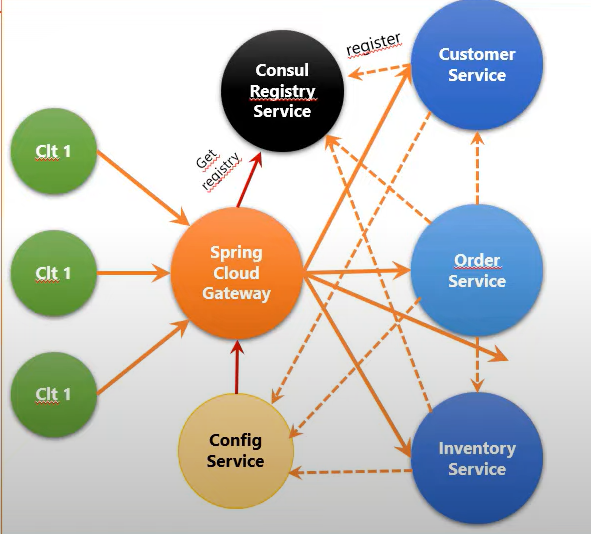
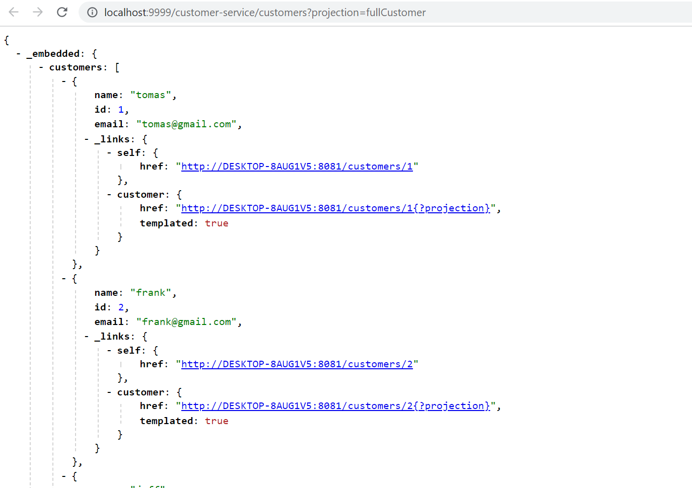
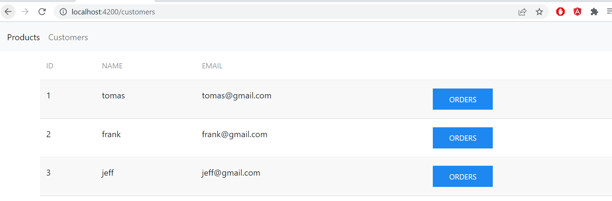

# micro-services-consul-config-gateway
## App architecture

## consule serivices

## customer service API

## Order service API

## Web App

# MS security with keycloak
## Customer client

## Users

## Roles

## Tester l'authentification avec un mot de passe

## Tester l'authentification avec le Refresh Token

## Tester l'authentification avec Client ID et Client Secret

## Sécuriser L'architecture Micro services Du projet Customer-service

