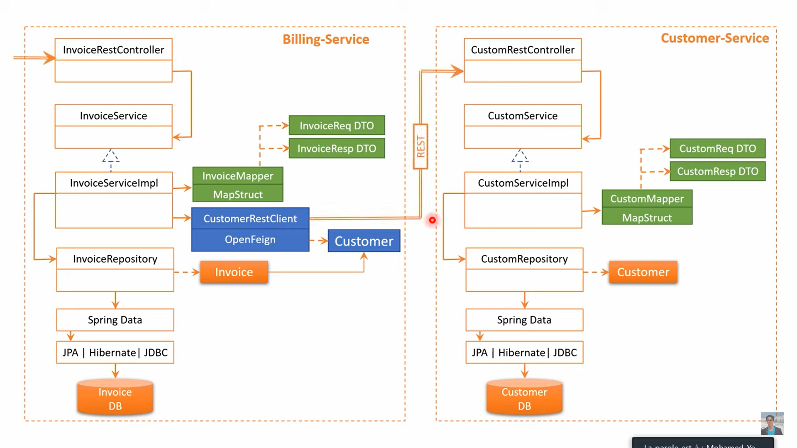
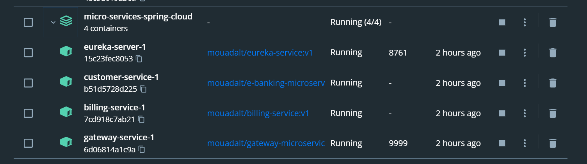
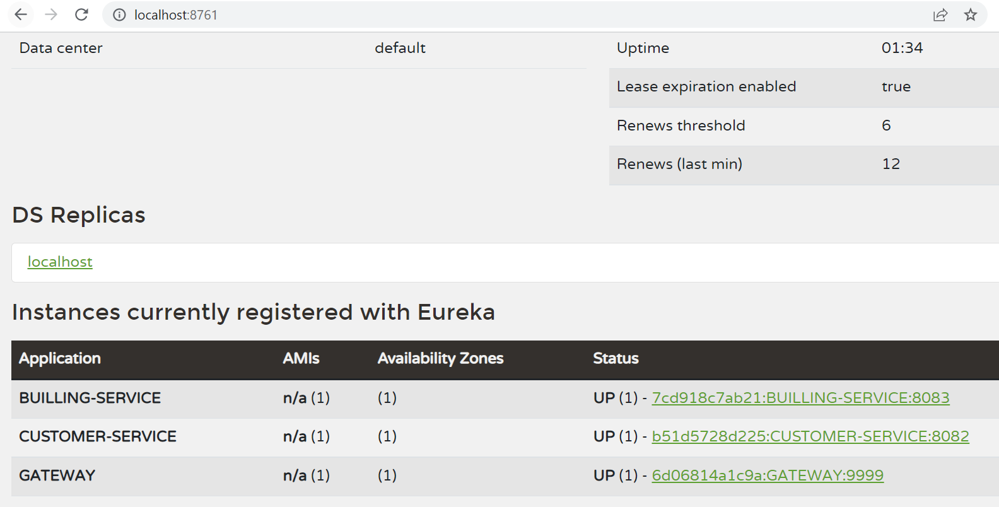
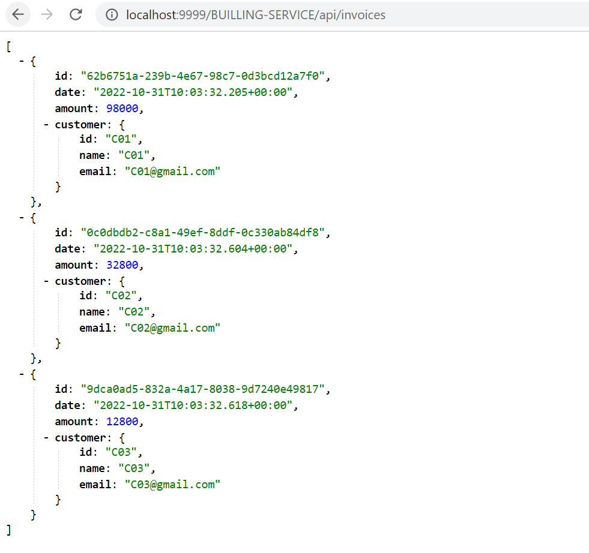
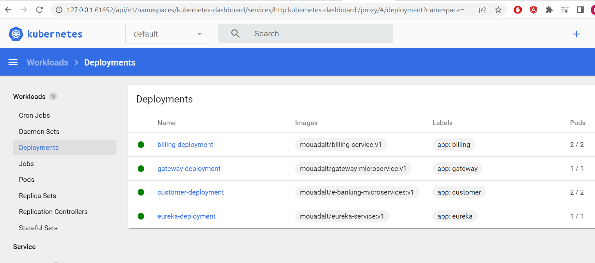
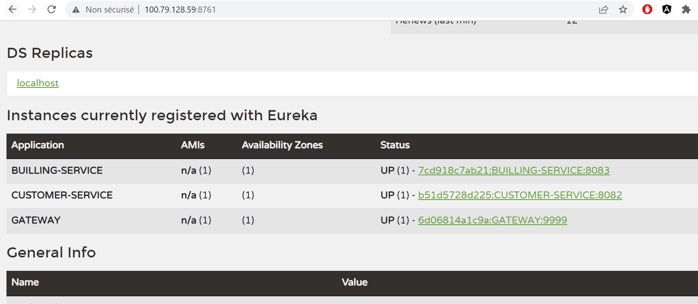
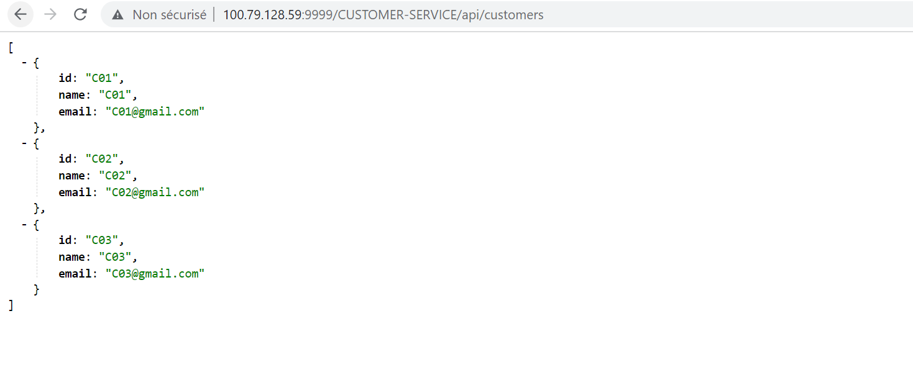

#  micro-services-spring-cloud

## Project structure 

## 1 - Docker compose
```

version: "3.1"

services:
eureka-server:
image: mouadalt/eureka-service:v1
environment:
- server.port=8761
  - eureka.client.fetch-registry=false
  - eureka.client.register-with-eureka=false
  ports:
  - 8761:8761

customer-service:
image: mouadalt/e-banking-microservices:v1
environment:
- eureka.instance.prefer-ip-address=true
  - server.port=8082
  - spring.application.name=CUSTOMER-SERVICE
  - spring.h2.console.enabled=true
  - spring.cloud.discovery.enabled=true
  - spring.datasource.url=jdbc:h2:mem:customer-db
  - eureka.client.service-url.defaultZone=http://eureka-server:8761/eureka

      depends_on:
        - eureka-server


billing-service:
image: mouadalt/billing-service:v1
restart: on-failure
environment:
- eureka.instance.prefer-ip-address=true
  - server.port=8083
  - spring.application.name=BUILLING-SERVICE
  - spring.h2.console.enabled=true
  - spring.cloud.discovery.enabled=true
  - spring.datasource.url=jdbc:h2:mem:builling-db
  - eureka.client.service-url.defaultZone=http://eureka-server:8761/eureka

      depends_on:
        - customer-service
        - eureka-server


gateway-service:
image: mouadalt/gateway-microservice:v1
environment:
- eureka.instance.prefer-ip-address=true
  - server.port=9999
  - spring.application.name=GATEWAY
  - spring.cloud.discovery.enabled=true
  - eureka.client.service-url.defaultZone=http://eureka-server:8761/eureka

      ports:
        - 9999:9999
      depends_on:
        - billing-service
        - customer-service
        - eureka-server
```
###  - All containers are running

###  - Testing eureka server and rest api



##  - Deploying App in a k8s cluster
###  - example of a k8s config file for billing service
```

apiVersion: apps/v1
kind: Deployment
metadata:
name: billing-deployment
namespace: default
labels:
app: billing
spec:
replicas: 2
selector:
matchLabels:
app: billing
template:
metadata:
labels:
app: billing
spec:
containers:
- name: billing-container
image: mouadalt/billing-service:v1
env:
- name: eureka.instance.prefer-ip-address
value: 'true'
- name: server.port
value: '8083'
- name: spring.application.name
value: BUILLING-SERVICE
- name: spring.h2.console.enabled
value: 'true'
- name: spring.cloud.discovery.enabled
value: 'true'
- name: spring.datasource.url
value: jdbc:h2:mem:billing-db
- name: eureka.client.service-url.defaultZone
value: http://eureka-server:8761/eureka
ports:
- containerPort: 8083


apiVersion: v1
kind: Service
metadata:
namespace: default
name: billing-service
labels:
run: billing-service
spec:
ports:
- port: 8083
targetPort: 8083
protocol: TCP
type: LoadBalancer
selector:
app: billing
```
###  - K8s dashboard


###  - testing app



