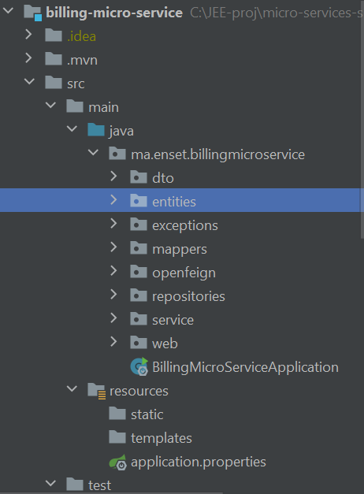
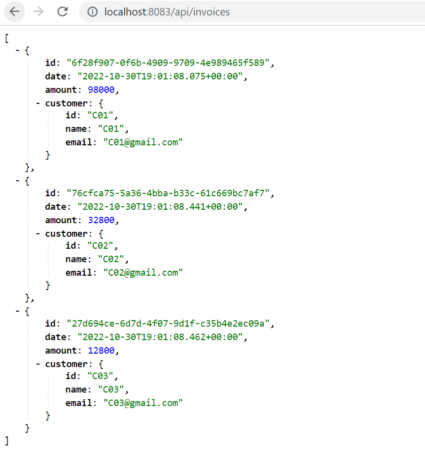
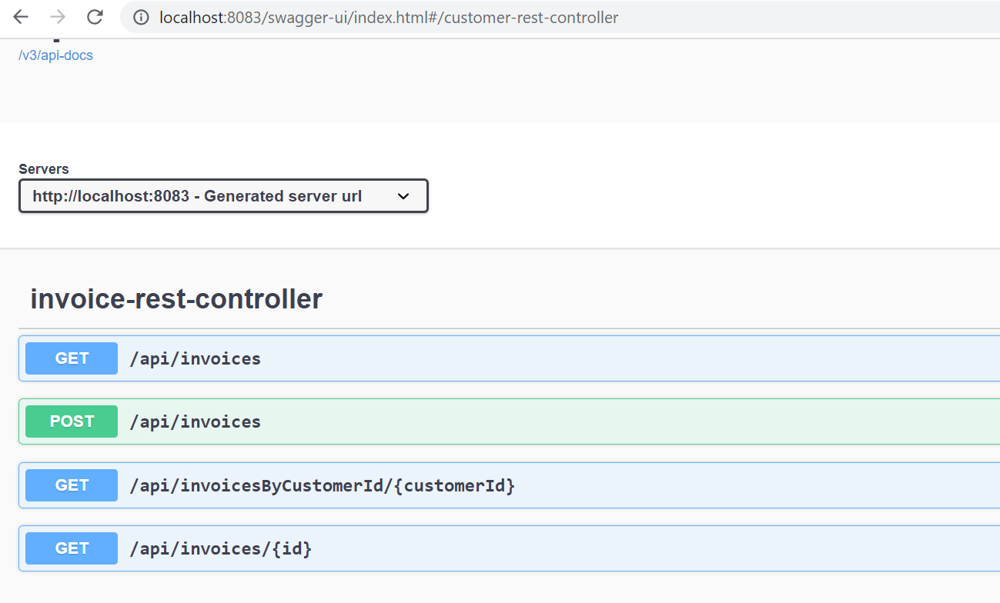
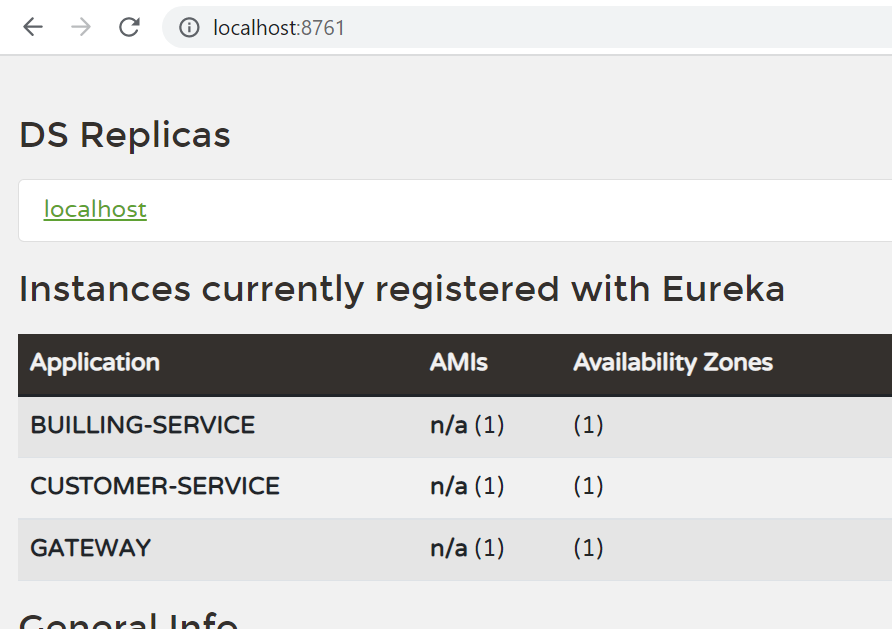

#  Billing micro service
## application.properties:
    spring.datasource.url=jdbc:h2:mem:billing-db
    spring.h2.console.enabled=true
    server.port=8083
    spring.application.name=BILLING-SERVICE
    spring.cloud.discovery.enabled=true
    eureka.instance.prefer-ip-address=true
##Project structure

## 1 - entities
    @Entity
    @Data
    @AllArgsConstructor
    @NoArgsConstructor
    public class Invoice {
    @Id
    private String id;
    private Date date;
    private BigDecimal amount;
    private String customerId;
    @Transient
    private Customer customer;
    
    }

## 2 - dtos
    @Data
    @AllArgsConstructor
    @NoArgsConstructor
    public class InvoiceRequestDTO {
    private BigDecimal amount;
    private String customerId;
    
    
    }
    
    @Data
    @AllArgsConstructor
    @NoArgsConstructor
    public class InvoiceResponseDTO {
    private String id;
    private Date date;
    private BigDecimal amount;
    private Customer customer;
    
    }
## 3 - repositories
    public interface InvoiceRepository extends JpaRepository<Invoice,String> {
    List<Invoice> findByCustomerId(String customerId);
    }
## 4 - mappers

    @Mapper(componentModel = "spring")
    public interface InvoiceMapper {

    InvoiceMapper INSTANCE= Mappers.getMapper(InvoiceMapper.class);
    InvoiceResponseDTO invoiceToInvoiceResponseDTO(Invoice invoice);
    InvoiceRequestDTO invoiceToInvoiceRequestDTO(Invoice invoice);
    Invoice invoiceResponseDTOToInvoice(InvoiceResponseDTO invoiceResponseDTO);
    Invoice invoiceRequestDTOToInvoice(InvoiceRequestDTO invoiceRequestDTO);

    }
## 5 - services

    public interface InvoiceService {
    public InvoiceResponseDTO save(InvoiceRequestDTO invoiceRequestDTO);
    public InvoiceResponseDTO update(InvoiceRequestDTO invoiceRequestDTO);
    public InvoiceResponseDTO getInvoiceById(String invoiceId);
    public List<InvoiceResponseDTO>  allInvoices( );
    public List<InvoiceResponseDTO> getInvoicesByCustomerId(String customerId);
    
    }
## 6 -open feign 

    @FeignClient(name = "CUSTOMER-SERVICE")
    public interface CustomerRestClient {
    @GetMapping(path = "/api/customers/{id}")
    Customer getCustomer(@PathVariable String id);
    @GetMapping(path = "/api/customers")
    List<Customer> allCustomers();
    }
## 7 -web layer
        @RestController
    @RequestMapping(path = "/api")
    @AllArgsConstructor
    public class InvoiceRestController {
    private InvoiceService invoiceService;
    @PostMapping(path = "/invoices")
    public InvoiceResponseDTO save(@RequestBody InvoiceRequestDTO invoiceRequestDTO){
    return invoiceService.save(invoiceRequestDTO);
    }
    @GetMapping(path = "/invoices/{id}")
    public InvoiceResponseDTO getInvoice(@PathVariable String id){
    return invoiceService.getInvoiceById(id);
    }
    
        @GetMapping(path = "/invoicesByCustomerId/{customerId}")
        public List<InvoiceResponseDTO>  getInvoicesByCustomerId(@PathVariable String customerId){
            return invoiceService.getInvoicesByCustomerId(customerId);
        }
        @GetMapping(path = "/invoices")
        public List<InvoiceResponseDTO>  allInvoices(){
            return invoiceService.allInvoices();
        }
    }

# Testing API

# Eureka server

