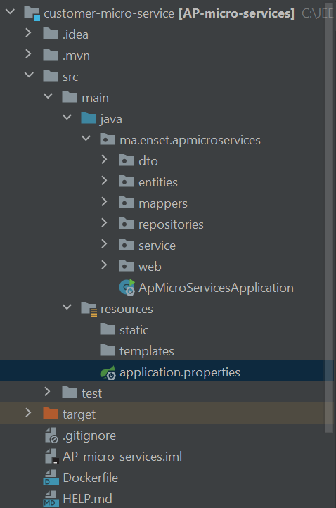

#  Customer micro service
## application.properties:
    spring.datasource.url=jdbc:h2:mem:customer-db
    spring.h2.console.enabled=true
    server.port=8082
    spring.application.name=CUSTOMER-SERVICE
    spring.cloud.discovery.enabled=true
    eureka.instance.prefer-ip-address=true
##Project structure 

## 1 - entities
    @Entity
    @Data @AllArgsConstructor @NoArgsConstructor
    @Builder
    public class Customer {
    @Id
    private String id;
    private String name;
    private String email;
    }
## 2 - dtos
    @Data @NoArgsConstructor @AllArgsConstructor
    public class CustomerRequestDTO {
    private String id;
    private String name;
    private String email;
    }

    @Data @NoArgsConstructor
    @AllArgsConstructor
    public class CustomerResponseDTO {
    private String id;
    private String name;
    private String email;
    }
## 3 - repositories
    public interface CustomerRepository extends JpaRepository<Customer,String> {
    }
## 4 - mappers

    @Mapper(componentModel = "spring")
    public interface CustomerMapper {
    CustomerMapper INSTANCE= Mappers.getMapper(CustomerMapper.class);
    CustomerResponseDTO customerToCustomerResponseDTO(Customer customer);
    CustomerRequestDTO customerToCustomerRequestDTO(Customer customer);
    Customer customerResponseDTOToCustomer(CustomerResponseDTO customerResponseDTO);
    Customer customerRequestDTOToCustomer(CustomerRequestDTO customerRequestDTO);
    
    }
## 5 - services

    public interface CustomerService {
    public CustomerResponseDTO save(CustomerRequestDTO customerRequestDTO);
    public CustomerResponseDTO getCustomer(String id);
    public CustomerResponseDTO update(CustomerRequestDTO customerRequestDTO);
    public List<CustomerResponseDTO> listCustomers();
    
    }
## 6 -web layer
    @RestController
    @RequestMapping(path = "/api")
    @AllArgsConstructor
    public class CustomerRESTController {
    private CustomerService customerService;
    @GetMapping(path = "/customers")
    public List<CustomerResponseDTO> cutomers(){
    return customerService.listCustomers();
    }
    @PostMapping(path ="/customers")
    public CustomerResponseDTO save(@RequestBody CustomerRequestDTO customerRequestDTO)
    {
    customerRequestDTO.setId(UUID.randomUUID().toString());
    return customerService.save(customerRequestDTO);
    }
    @GetMapping(path = "/customers/{id}")
    public CustomerResponseDTO getCutomers(@PathVariable String id){
    return customerService.getCustomer(id);
    }
    
    }
# Testing API

# Eureka server 

