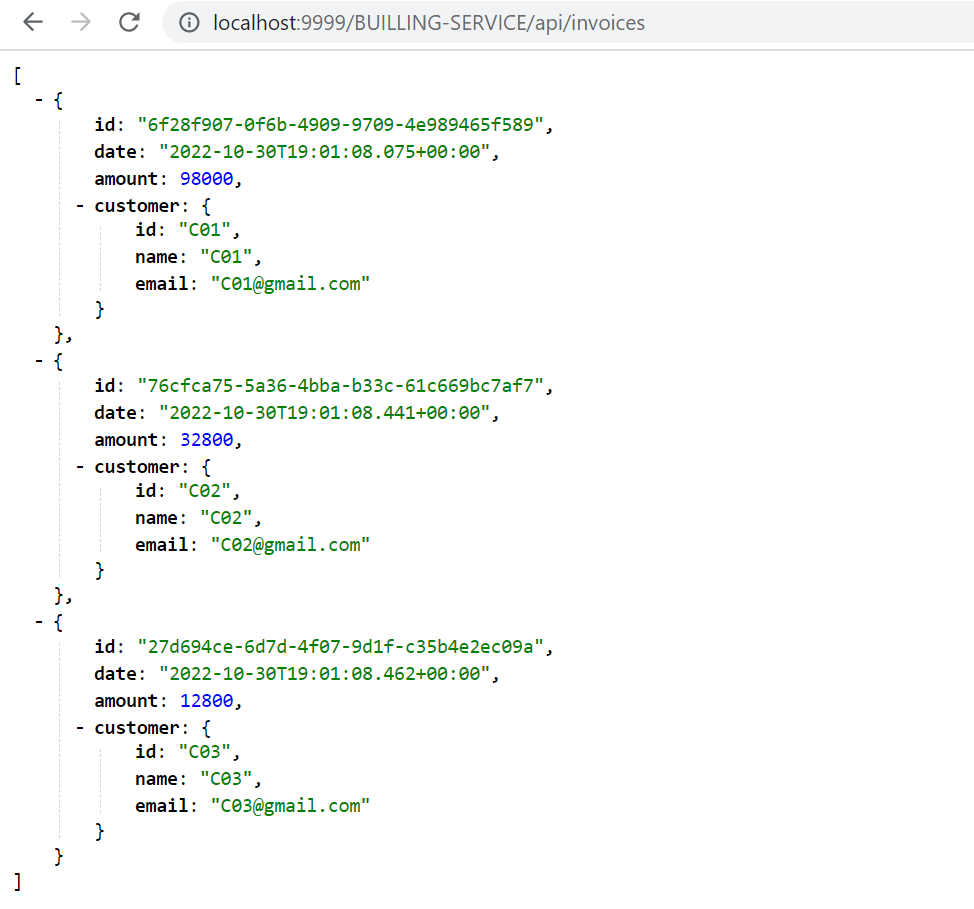

#  GateWay service


## application.properties :


```
server.port=8888
spring.application.name=GATEWAY
spring.cloud.discovery.enabled=true
eureka.instance.prefer-ip-address=true
```


## Main App :


```
@SpringBootApplication
public class GatewayApplication {
    public static void main(String[] args) {
        SpringApplication.run(GatewayApplication.class, args);
    }
    @Bean
    DiscoveryClientRouteDefinitionLocator discoveryClientRouteDefinitionLocator(
            ReactiveDiscoveryClient reactiveDiscoveryClient, DiscoveryLocatorProperties discoveryLocatorProperties
    ){
      
        return new DiscoveryClientRouteDefinitionLocator(reactiveDiscoveryClient, discoveryLocatorProperties) ;
    }
}
```

<br>


# Testing app


